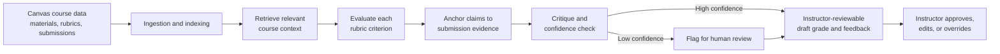

<div align="center">
  <h1>EduConnect AI</h1>
  <p><strong>Evidence-grounded AI grading and educational scaffolding for Canvas courses.</strong></p>
  <p>
    <a href="#demo">Demo</a> ·
    <a href="#how-it-works">How it works</a> ·
    <a href="#quick-start">Quick start</a> ·
    <a href="#trust-and-safety">Trust & safety</a>
  </p>
</div>

> **Project status:** Early-stage research and development project at the University of South Florida College of Education, VISTA Lab. EduConnect AI provides instructor-reviewable draft grades and feedback; it does not replace educator judgment.


## Overview

EduConnect AI is a Canvas-connected platform designed to reduce grading workload while keeping instructional judgment with the instructor. It evaluates student work against instructor rubrics and course materials, then returns an evidence-backed draft grade, feedback, and a traceable rationale for review.

Instead of treating an LLM score as the answer, EduConnect uses a **reasoning-based RAG** workflow: retrieve relevant course context, evaluate rubric criteria individually, anchor claims to submission evidence, run a critique pass, and route uncertain cases to an educator.

## Demo

### Product walkthrough

[](https://youtu.be/1Hw0SclGrQc)

▶️ **[Watch the 2-minute EduConnect AI walkthrough](https://youtu.be/1Hw0SclGrQc)**

> Replace the video ID `RJ5QKtY_peQ` above if you publish a new demo. The thumbnail and the link will update together.

## Why EduConnect AI?

Grading often requires educators to spend hours reviewing student work, and feedback can arrive after the material is no longer fresh. Generic AI grading tools can also produce scores that are difficult to inspect or justify.

EduConnect AI is built around a different principle: **a score should be reviewable, attributable to the rubric, and supported by evidence.** The educator remains the final decision-maker.

## Key capabilities

| Capability | What it does |
|---|---|
| **Canvas-connected workflow** | Works with course, assignment, submission, rubric, and activity data so instructors do not need to move work into a separate grading process. |
| **Reasoning-based RAG** | Grounds evaluation in instructor-provided course materials instead of relying only on model recall. |
| **Criterion-level evaluation** | Breaks a rubric into smaller, reviewable requirements rather than producing one opaque holistic score. |
| **Evidence anchoring** | Connects scoring decisions to relevant course context and verbatim evidence from the student submission. |
| **Self-critique and escalation** | Uses a second-pass critique and confidence checks to identify cases that require human review. |
| **Instructor control** | Lets educators inspect, edit, approve, or override recommendations at any time. |
| **Learning analytics** | Supports class-level visibility into performance patterns and student activity signals. |

## How it works



### Five-layer trust architecture

1. **RAG grounding** — Evaluation is tied to instructor-provided course materials.
2. **Rubric adherence** — Each criterion is assessed separately rather than estimated holistically.
3. **Evidence anchoring** — The system surfaces supporting excerpts from the submission and relevant course context.
4. **Self-critique and confidence** — A critique pass checks the proposed reasoning and flags uncertainty.
5. **Human override** — Instructors retain final authority over every grade and piece of feedback.

## Interface highlights

- **Evaluation Nexus:** Review assignments, submissions, AI-generated draft grades, and evidence in one place.
- **Educator Hub:** View course-level information and grading workflow status.
- **Class Ledger:** Monitor student, assignment, and grade trends in a Canvas-synced view.
- **Clickstream Activity Hub:** Explore course-engagement signals alongside assessment information.

## Technology

The current application uses a modern web stack for AI-assisted educational workflows:

- **Frontend:** React, TypeScript
- **Backend:** Python, asynchronous FastAPI
- **AI:** Google Gemini API, multi-model evaluation workflow
- **Retrieval:** Semantic RAG with PostgreSQL and pgvector
- **Integrations:** Canvas LMS APIs
- **Security:** Role-aware access controls and row-level security

## Quick start

### Prerequisites

- Node.js 18+
- npm
- A Gemini API key

### Install and run

```bash
git clone https://github.com/<YOUR_GITHUB_USERNAME>/<YOUR_REPOSITORY_NAME>.git
cd <YOUR_REPOSITORY_NAME>
npm install
```

Create `.env.local` in the project root:

```bash
GEMINI_API_KEY=your_gemini_api_key
```

Start the development server:

```bash
npm run dev
```

Open the local URL shown in your terminal, typically `http://localhost:5173`.

> Never commit `.env.local` or API keys. Add `.env.local` to `.gitignore`.

## Trust and safety

EduConnect AI is designed as decision support, not autonomous grading. Its output should always be reviewed by an authorized instructor before grades or feedback are released to students.

Known limitations include incomplete course materials, assignments with visual-only content, and calibration differences across courses or rubrics. Low-confidence cases should be routed to human review. Formal studies of grading agreement and reliability are ongoing/planned.

## Research context

EduConnect AI is being developed through the University of South Florida College of Education's VISTA Lab under the leadership of Professor Bo Pei. The project focuses on context-aware grading, educational scaffolding, and transparent AI support for educators.

## Contributing

This is a research project. If you are collaborating on the project, please create a branch, make focused changes, and open a pull request with a concise description of the change and any testing performed.

## Contact

**Project lead:** Dr. Bo Pei — [bpei@usf.edu](mailto:bpei@usf.edu)  
**Developer:** Karthikeya Moturi — [GitHub](https://github.com/Karthikeya22) · [LinkedIn](https://www.linkedin.com/in/km22)

---

<p align="center">Built to help educators spend less time on repetitive grading and more time supporting learning.</p>
